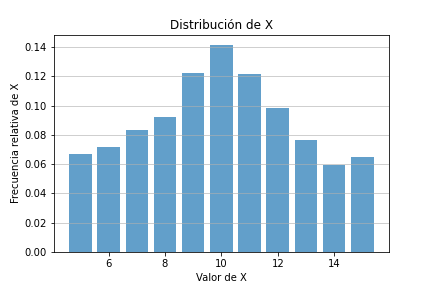
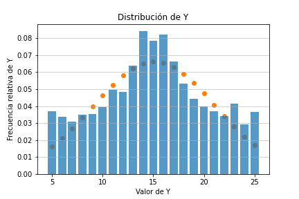
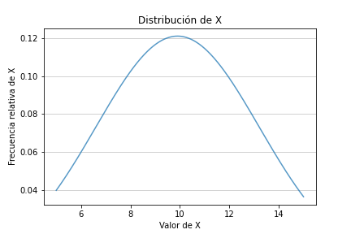
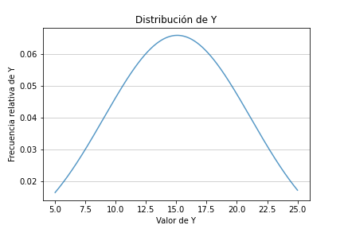
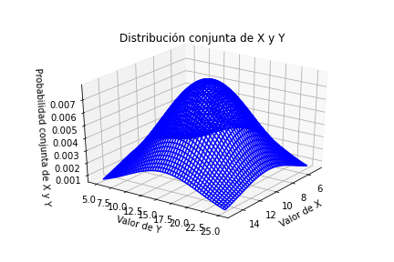

# Tarea 3: Variables aleatorias múltiples

## Asignación 1: Curvas de ajuste para funciones marginales

El cuaderno de jupyter para la solución de esta asignación se halla en [Pregunta1.ipynb](Pregunta1.ipynb).

Para estudiar el contenido de los archivos CSV proporcionados se utilizó la biblioteca `pandas` de Python y para el procesamiento de los datos, así como el ajuste de los mismos a una función de densidad conocida con `stats`.  

Para tener una idea inicial de las distribuciones marginales de los datos, se graficaron las probabilidades marginales y se obtuvieron las siguientes dos figuras:

Entre las distribuciones conocidas del curso, estas dos figuras se asemejan más a la distribución normal. Por esto, se decide hacer el ajuste de cada probabilidad marginal a una distribución normal. Esto se realiza mediante la definición de una función `gaussian` que acepta una lista de datos (en este caso los rangos de valores de X y Y que se proporcionan), el $\sigma$ y el $\mu$ de la distribución normal y retorna una lista con los valores correspondientes a la distribución normal con estos datos.  

Luego, se utiliza la función `curve_fit` del módulo `scipy.optimize` para obtener el $\sigma$ y el $\mu$ del ajuste correspondiente a los datos obtenidos. Se obtienen las siguientes dos gráficas con el ajuste:  

Con estos datos, se obtuvieron los siguientes parámetros de ajuste:  

- $\sigma_x \approx 3.3$
- $\mu_x \approx 9.905$
- $\sigma_y \approx 6.03$
- $\mu_y \approx 15.08$

Se puede observar que las curvas de ajuste normal no calzan perfectamente con las distribuciones que se tienen, pero esto se puede deber a ruido en la medición de los datos, así como error de muestreo. La forma general de los datos calza considerablemente bien y se considera entonces que ambas distribuciones marginales realmente tienen una distribución normal. Entonces, las funciones de densidad marginales para X y Y serían descritas por:  

- $f_X(x) = \frac{1}{\sqrt{2\cdot\pi\cdot3.3^2}} e^{ \frac{-(x-9.905)^2}{2\cdot 3.3^2} }$  
- $f_Y(y) = \frac{1}{\sqrt{2\cdot\pi\cdot6.03^2}} e^{ \frac{-(y-15.08)^2}{2\cdot 6.03^2} }$  

## Asignación 2: Función de densidad conjunta para dos r.v. independientes

Como las dos variables aleatorias son independientes, se tiene que su densidad marginal conjunta es dada por:

$$f_{X,Y}(x,y) = f_X(x)\cdot f_Y(y)$$  

Entonces se toman las funciones obtenidas en el inciso anterior y se obtiene:  

$$ f_{X,Y}(x,y) = \frac{1}{\sqrt{2\cdot\pi\cdot3.3^2}} e^{ \frac{-(x-9.905)^2}{2\cdot 3.3^2} } \cdot \frac{1}{\sqrt{2\cdot\pi\cdot6.03^2}} e^{ \frac{-(y-15.08)^2}{2\cdot 6.03^2} }$$

Simplificando, esta función tiene un valor aproximado de:  

$$ f_{X,Y}(x,y) = \frac{1}{2\pi \cdot 19.9 } e^{ -\frac{ (x-9.905)^2} {21.78}  - \frac{(y - 15.08)^2}{72.72} } $$

## Asignación 3: Correlación, covarianza y coeficiente de Pearson

El cuaderno de jupyter para la solución de esta asignación se halla en [Pregunta3.ipynb](Pregunta3.ipynb).

### Correlación

La correlación se define con $R_{XY} = E[XY]$ e indica "cuánto se parecen dos variables aleatorias", o bien más formalmente "cuantifica el grado en el que dos cantidades están linealmente asociadas". Hay que destacar que la correlación no implica causalidad, dado que dos datos o variables pueden tener formas similares para describir fenómenos diferentes e independientes entre sí. 

Para calcular la correlación en Python, se tomaron los datos del archivo [xyp.csv](xyp.csv) en un DataFrame de Pandas. Luego, se usó la definición de $E[XY]$, dada por:

$$ \int_{-\infty}^\infty \int_{-\infty}^\infty xyf_{X,Y}(x,y) ~dx~dy $$

Solo que se "traduce" a su versión discreta para trabajarla con los datos discretos que tenemos. Es decir, se toma cada par de valores de X, Y y su probabilidad, se multiplican y se suman. Esto se hace mediante la multiplicación de las columnas del dataframe obtenido (que tiene una columna con los valores de X, Y y la probabilidad asociada a ambos). Luego, se utiliza la función `sum()` de un DataFrame de pandas para sumar todos los productos, de modo que se obtiene $E[XY]$ para los datos.  

Como los datos son independientes, también se tiene $E[XY] = E[X]E[Y]$. Entonces, se puede calcular el valor esperado de cada variable aleatoria por separado y multiplicar ambas, de modo que se debería obtener el mismo valor (o al menos uno aproximado, considerando errores de ruido y muestreo).  

Se realizaron estas dos formas en el cuaderno, para comparar los resultados (y corroborar la independencia de las variables). Con la primer metodología se obtuvo:

$$E[XY] \approx 149.54$$

Con la segunda metodología se obtuvo:

$$E[X]E[Y] \approx 149,48$$

Se puede ver que ambos valores se aproximan bastante entre sí, por lo que se asegura la independencia de los datos. Entonces, se puede ver que el valor relativamente alto de correlación indica que tienen un alto grado de asociación lineal entre sí. Sin embargo, esto es la correlación entre dos variables independientes, como se ve por el hecho de que $E[XY] \approx E[X][Y]$.

### Covarianza
La covarianza es una medida que describe la manera en la que crece una variable con respecto a la otra. Una covarianza positiva con magnitud grande indica que ambas variables tienen la misma tendencia de crecimiento (si una sube, la otra también) y que un cambio grande y positivo en una implica un cambio grande y positivo en la otra, mientras que una covarianza negativa de gran magnitud indica que ambas variables tienen tendencias opuestas de crecimiento (si una sube, la otra baja) y un cambio grande y positivo en una implica un cambio grande y negativo en la otra. Una covarianza es igual a 0 cuando las variables en estudio no están correlacionadas/son independientes.

Se sabe que es dada por la relación:

$$ C_{XY} =  E[(X - \overline{X})][(Y - \overline{Y})] = R_{XY} - E[X]E[Y]$$

Entonces, la covarianza se calcula con los valores de $E[XY]$ y $E[X][Y]$ obtenidos anteriormente. Se tiene:

$$C_{XY} \approx 149.54 - 149.48 = 0.06$$

Como este valor es bastante pequeño, se asegura que ambas variables son independientes.

### Coeficiente de correlación de Pearson

El coeficiente de correlación de Pearson $\rho$ es un momento normalizado, una medida que indica la correlación entre dos variables. El valor mínimo que puede tener es -1, que indica una correlación negativa lineal total entre las variables (es decir, si una variable aumenta en una cierta cantidad, la otra disminuye proporcionalmente a esa cantidad), mientras que el valor máximo de 1 indica una correlación positiva lineal total.

Este momento se obtiene por la relación:

$$\rho = \frac{E[(X-\overline{X})] E[Y-\overline{Y}]}{\sigma_x\sigma_y} = \frac{C_{XY}}{\sigma_x \sigma_y}$$

Se obtuvo $C_{XY}$ anteriormente. Se utilizarán los valores de varianza obtenidos para la Asignación 1, que si bien corresponden al modelo teórico y se calculó $C_{XY}$ con los experimentales, debería ser una aproximación suficientemente buena para estos efectos. Se tiene:

$$\rho \approx \frac{0.06}{3.3\cdot6.03} \approx 3.015 \cdot 10^{-3}$$

Se ve que el valor del coeficiente obtenido es muy pequeño, lo cual es otro indicador más sobre la independencia de los datos estudiados.

## Asignación 4: Graficación de los modelos

El cuaderno de Jupyter de esta asignación se halla en [Pregunta4.ipynb](Pregunta4.ipynb)

Para $f_X(x)$ se tiene:

Para $f_Y(y)$ se tiene:

Para $f_{X,Y}(x,y)$ se tiene:

